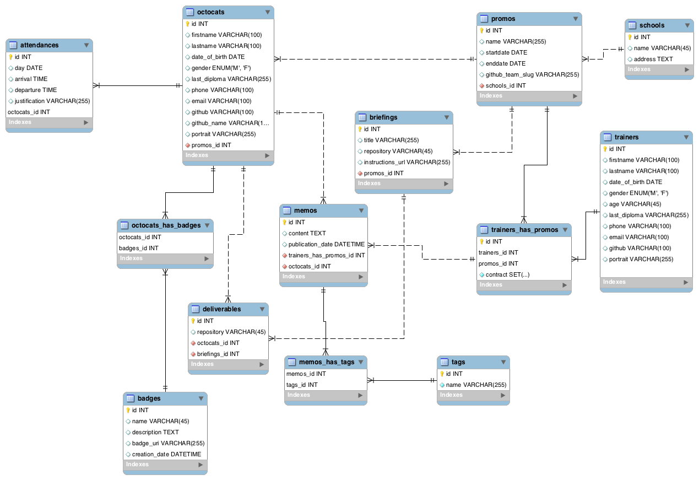
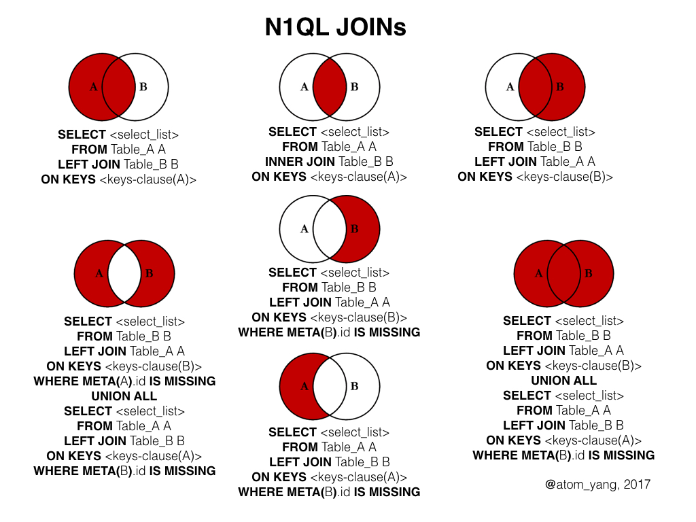

# Relational databases : JOIN

Here is the content of a database, containing relational tables. In other words, tables having "relations" between them.



## What is a relation ?

It's a bit like a school locker room. So that each child can find their jacket, **we put a label with their name on the jacket.**

So, if we want to know who owns the jacket, we read the content of the label.

It's the same principle in relational databases. **Except that the label, in this case, will be a unique identifier number** (there is not 2x the same in the same table). Consider the diagram above: What are the fields that serve as labels, as **primary key**?

## What's the point ?

Imagine that you have to create a new application, the client of which would be ... BeCode.
You need to manage registrations and the distribution of juniors in BeCode promos. So answer to the question: *which junior goes to which promo?*.

For this, the application would display a list of juniors (octocats) by promo, with their first and last names.

Like every year, there will be new promos and new juniors, we will design a database to manage this information.

To be functional, which tables does your application need?

### Take 5 minutes with a piece of paper and a pen

List each information needed to realize this: *"display a list of juniors by promo, with their firstname and lastname"*.  

Organize this list by grouping together what goes together:

- what describes a promo?
- what describes a junior?

You have enough information to design your SQL tables, except ...

### How to store in your tables which promo each student belongs to?

Here the table storing the "promos":

**Table: Promos**

| Promo   |
|------------|
|  Jepsen-5  |
|  Hamilton-5 |

With a unique identifier, an `id`, the table becomes:

| id |  promo   |
|----|------------|
|  1 | Jepsen-5  |
|  2 | Hamilton-5 |

So, if in another table I want to refer to the promo "Jepsen-5", I point to its `id`: "1".

*👉 This `id` here is the `primary key`.*

So, I could store the information allowing to record which promo the student belongs to in the juniors table by adding a column for this purpose, in which my application stores the ID number of the relevant promotion:

**Table : Juniors**

| id | name | promo_id |
|----|---------|-----------|
|  1 | Fanny   |         1 |
|  2 | JC |         1 |
|  3 | Ludovic  |         2 |
|  4 | Zoé  |         2 |

Notice how, to make *life* easier for me, I called the column using the name of the associated table?

`"table" + "_" + "**primary key from promo**" = promo_id`.

In truth, you call your column as you want, but it always pays to choose systematically simple and explicit names.

*👉 Here the `promo_id` is called a `foreign key`, because this id refers to an another table.*

Can you, on the basis of `promo_id`, find the promo to which each junior belongs to?

In SQL, the operation consists in doing a `JOIN` :

```sql
SELECT * FROM juniors
LEFT JOIN promos ON promos.id=juniors.promo_id;
```

This principle of relationship is extremely powerful. It allows to create databases for anything that can be imagined in a rational way.

## The relationships

### Relation 1-to-many (or relation 1:N)
The relationship that links promos and juniors in the previous example is a "1-to-many" relationship: each promo can have several juniors, but each junior can only have one promo.

Other examples of entities whose relation is 1-to-many :

- writer / books: "a writer has several books / a book has only one writer".
- football team / player: "a football team has several players / a player has only one football team".
- human being / city of birth: "a human being has a city of birth / a city has more than one human".

([doc](https://www.tutorialsteacher.com/sqlserver/tables-relations#one-to-many-relation))

### Relation many-to-many (or relation N:N)

In a "many-to-many" relationship, each row in table "A" can have one or more relationships with rows in table "B".
We therefore need **a specific table storing the relations**.

For example, a team of salespeople must sell different products. 
Whe should be able to CRUD the sellers, the products and the sales. 
A sale is actually storing the information that a so-and-so seller has sold a so-and-so product.

**table: sellers**

| id | Seller Name |
|----|---------|
|  1 | Raoni |
|  2 | Maxime  |
|  3 | Tiffany    |

**table: products**

| id | Product Name |
|----|---------|
|  1 | Pommes  |
|  2 | Poires  |
|  3 | Bananes |

**table: purchases**

| product_id | seller_id |
|------------|-----------|
|          3 |         1 |
|          3 |         1 |
|          1 |         1 |
|          1 |         2 |
|          2 |         2 |
|          1 |         3 |
|          3 |         3 |


This table is called a **junction table**. You need to create it to be able to have many-to-many relations between tables. It contains two foreign key references. 
(See this [doc](https://www.tutorialsteacher.com/sqlserver/tables-relations#many-to-many-relation))

To get the details of sales in SQL, we use the `JOIN` syntax:

```sql
SELECT * FROM purchases
LEFT JOIN products ON purchases.product_id=products.id
LEFT JOIN sellers ON sellers.id=purchases.seller_id ;
```

*NOTE: after the `ON` you can write the equivalent in order you want, it changes nothing. The most important is the tables you select*

So from the purchases table, you can call the products 

You can try this command in this [SQL Fiddle](http://sqlfiddle.com/#!9/948105)

The result could be a little bit messy. You are free to make your query to have more order. For example with `ÒRDER BY` : 

```sql
SELECT seller_name, product_name FROM purchases
LEFT JOIN products ON purchases.product_id=products.id
LEFT JOIN sellers ON purchases.seller_id=sellers.id
ORDER BY seller_name;
```

Of course, in this example, we could create an `id` column as primary key for the purchases table, like this :

**table: purchases**

|id| product_id | seller_id |
|--|------------|-----------|
| 1|          3 |         1 |
| 2|          3 |         1 |
| 3|          1 |         1 |
| 4|          1 |         2 |
| 5|          2 |         2 |
| 6|          1 |         3 |
| 7|          3 |         3 |

### Relation 1-to-1 (or relation 1:1)
Very little used, in general it is better to merge them into a single table.

([doc](https://www.tutorialsteacher.com/sqlserver/tables-relations#one-to-one-relation)).

## To read

- [extra doc about JOIN](https://learnsql.com/blog/how-to-left-join-multiple-tables/)

## LEFT JOIN, RIGHT JOIN, INNER JOIN. UNION

Got it all? Know that you can do more than "simple" "LEFT JOIN" but the "LEFT JOIN" is the most common used. 


