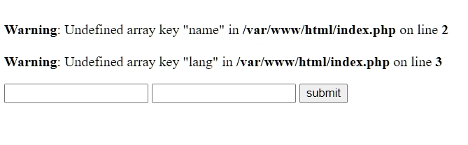

# Training : GET - POST

|Challenge Parameters  |Challenge Details              |
|:---------------------|:------------------------------|
|Repository            |`get-post-training`        |
|Challenge type        |`Learning`                     |
|Duration              |`1,5 hour`                       |
|Deployment method     |`NA`    |
|Group composition     |`Solo`    |
|Project submition     |`NA`     |

## Learning objectives
- Starting with PHP
	* Learn the syntax
  	* Build a simple HTML form
	* Use `$_GET` and `$_POST` superglobals with forms
	* echo variables using query strings with `$_GET`
	* echo variables without using query strings with `$_POST`
- To know where to search for PHP documentation


## What will we learn

We will show you how to work with PHP Superglobals such as **$_GET** and **$_POST** while using a security-conscious mindset. External inputs, like HTML forms, are considered a security vulnerability so you should 🚨 **always filter inputs and escape outputs**. Using PHP Superglobals when using external inputs such as HTML forms, cookies, sessions, and web servers will give you a security-conscious mindset that you can apply to all of your projects.

## Superglobals

A PHP superglobal is an associative array of data that's created by the server to capture information from URLs, HTML forms, cookies, sessions, and web servers. It's called a "superglobal" because the information in the array is available everywhere in your script.

Superglobals can be used globally without typing `global $variable`; which means they are available inside of functions or methods by default. How superglobally cool is that?

For a complete list of superglobals check out the [PHP Manual](https://www.php.net/manual/en/language.variables.superglobals.php).

You'll learn about the `$_GET` and `$_POST` superglobals which are used to capture information from forms and URLs.

---

## Working with `$_GET` Values

The `$_GET` superglobal is populated with information from the URL, in the form of a query string. You'll often build pages that use the information to display custom content to a user. For example, you could build a PHP website that displays profiles for different users. The user's profile name is sent along in the query string like this: `http://localhost/index.php?name=jonathan`

A query string starts with a `?` and the `$_GET` superglobal grabs this URL fragment name=jonathan. The page's PHP code would use this information to display a profile page for Jonathan.

A query string can include multiple parameters, like this: `http://localhost/index.php?name=jonathan&lang=php`. This query string includes two items -- name=jonathan & lang=php. An `&` separates the query string variables.

So how does a query string display information on a website? In this section we'll use several examples illustrating how it all works, let's get started!

### Working with Forms

Let's start by creating a web page containing a form. 

Look in this repo, you'll find a folder `resources` with inside a `index.php` file.  Open this file, there is already a simple HTML form indise. 

> 👉 NOTE: A form's method attribute must be set to `get` in order to submit form data via a URL.

Preview the page in a browser and you'll see a simple form.

If you fill out the form and click the submit button, you'll see information in the URL. The form is not fully functional so it does not print anything to the screen but you can use PHP to access that data.


### Accessing `$_GET` superglobals

Add the following PHP code between the opening <body> and <form> tags in the index.php file.

```php
<?php
	$name = $_GET['name'];
	$lang = $_GET['lang'];
	echo '<p>' . $name . '</p>';
	echo '<p>' . $lang . '</p>';
?>
```


Remember that `$_GET` is an associative array, so you use a key to access data -- the keys "name" and "lang" grab the values passed in the URL. For example, if the URL is `index.php?name=anne&lang=en`, then this code would store "anne" in the variable $name, and "en" in the variable $lang.

Open the index.php file in your local environment to run this code. Depending on your PHP settings, you may see a `Notice: Undefined index`. This error is produced because when you first open the index.php page (before submitting the form) while there are no values assigned in the URL for name or lang. The variables aren't defined until you submit the form.



To avoid this error, use an `if()` statement and the built-in `isset()` function to check if a variable has been set, if false, we don't set the variables and we avoid the Notice: Undefined index error. To illustrate this behavior, execute the included code example instead:

```php
<?php
   if (isset($_GET['name'], $_GET['lang'])){
      $name = $_GET['name'];
      $lang = $_GET['lang'];
      echo $name . '<br>'; 
      echo $lang;
   }
 ?>
```

Once you fill out and submit the form, you will see both variables display in the browser. Notice how submitting the form updates the URL with a query string.

Some of the implications of using the GET method with a form are:

- A security risk because the query string is visible
- Query strings can be modified easily and by anyone
- You can only submit a limited amount of information in a query string, so they're not useful for lots of information such as a blog post.
- Query strings and the `$_GET` superglobal are most useful for sending information that affects the content and presentation on a web page. For example, sending a product ID to a product page to present specific information on a single product.

### Using `$_GET` variables in a Function

We will rewrite the previous PHP by using a function :

```php
<?php
 function greeting() {
    $name = $_GET['name'];
    echo "Hello, " . $name;
 }
 greeting();

?>
```

> 👉 NOTE: The code below will display a Notice: Undefined index... and Hello, because we didn't set a variable.

As mentioned previously, you may see a Notice: Undefined index, because the `$name` variable has not been set. Remember, you can also fix the Notice: Undefined index with an `if()` statement with `isset()`, like this:

```php
<?php
if(isset($_GET['name'])){
    $name = $_GET['name']; 
}

function greeting(){
	if(isset($_GET['name'])) {
		$name = $_GET['name']; 
		echo "Hello, " . $name;
	}
}
greeting(); 
?>
```

The resulting code should return `Hello, Name`. 

---

## Working with `$_POST` 📯 Values

The `$_POST` superglobal sends data to a server in the message body and is not displayed in the URL with a query string like the `$_GET` superglobal. The `$_POST` variable data is saved in an array called `$_POST` which allows you to use `$_POST['name']` and `$_POST['lang']` superglobal variables respectively. All you need to do is change `$_GET` to `$_POST`, like this:

```php
<body>
  <form method="post" action="index.php">
    <input type="text" name="name">
    <input type="text" name="lang">
    <input type="submit" value="submit">
  </form>

 <?php
 if (isset($_POST['name'], $_POST['lang'])) {
    $name = $_POST['name'];
    $lang = $_POST['lang'];
    echo $name . '<br>'; 
    echo $lang;
 }
 ?>

</body>
```

When you execute this code, you will return your name and your programming language without displaying the data in the URL. This is one advantage of using the `$_POST` superglobal and also serves as an introduction to interacting with databases.

The main difference between `$_GET` and `$_POST` is that the data submitted in a POST request is sent to a server or an action page in the message body instead of a query string in the URL. In this case the POST request is sent to an action page called, `action="index.php"`. 

---

## Choosing Between `$_GET` and `$_POST`

If you aren't sure about when to use `$_GET` and `$_POST` superglobal variables, here are some basic rules that will help you get started. Check out the two examples below illustrating which superglobal variable to use and when.

### With Query String

Use the `$_GET` method if the information you’ll be passing is **not sensitive or a security vulnerability**. For example, a search function is a common use case which will pass the data through the URL.

### Without Query String

Use the `$_POST` 📯 superglobal if you want **to send sensitive data to a file or database in a more secure way**. For example, when passing a secure user password it's best to do so with a `$_POST` request that doesn't display the data in a query string in the URL.

---

## Filtering Inputs and Escaping Outputs 🚨

Inputs from contact forms and any external inputs in general should be considered a security vulnerability and should not be trusted to be what you might expect.

### Always Filter Inputs 🛂

The **`filter_input()`** or **`filter_var()`** functions filter and validate external variables coming from insecure sources, such as input forms. These functions are commonly used to prevent some security threats like SQL Injection(SQLi) attacks.

To illustrate this behavior, let’s take a simple query string like this:

```HTML
http://yourdomain.com/index.php?name=<a href="https://google.com">Click Me</a>
```

The query string contains the HTML to create a link. You should be careful when echoing `$_GET` superglobal variables like this:

```php
<?php
	echo $_GET[‘name’];
```

The above example would output a link to Google -- this is harmless. However, you can imagine a link to a phishing site, or a link that executes a malicious script. To avoid input that could lead to improper links or executing malicious code, you should filter all input with the `filter_input()` function like this:

```php
<?php
	echo filter_input( INPUT_GET, ‘name’, FILTER_SANITIZE_STRING );
```

With the same query string - `?name=<a href="https://google.com>Click Me</a>` - this PHP code strips out the `<a>` tag entirely and only echoes the string Click Me.

`filter_input()` provides added security by stripping or filtering code or malicious scripts from the query string. You should always filter inputs. The PHP `filter_input()` function accepts three arguments:

* The filter type:
	* INPUT_GET
	* INPUT_POST
	* INPUT_COOKIE
	* INPUT_SERVER
	* INPUT_ENV
* The name of the variable
* The ID or name of the filter to apply, see **[Types of Filters](https://www.php.net/manual/en/filter.filters.php)**
([the doc](https://www.php.net/manual/en/function.filter-input.php))

In this example, the first argument `INPUT_GET` identifies the input as coming from a query string. 'name' is the variable in the query string to filter. And the final argument is the filter to apply: when the input is a query string use the `FILTER_SANITIZE_STRING` argument. But there are also filters for numbers, email, special characters and more. If you were filtering an email, you would use `FILTER_SANITIZE_EMAIL`. To learn more about filter types check out the **[Sanitize Filters in the PHP manual](https://www.php.net/manual/en/filter.filters.sanitize.php)**.

If you prefer, you can use`filter_var()`. It accepts 2 arguments :
* The value to filter
* The filter
([the doc](https://www.php.net/manual/en/function.filter-var.php))

### Always Escape Outputs 🛃

**Output** is any data that leaves your application headed for another application or client. For example, adding a record to a database, or outputting information to a web page.

The goal of escaping output data is to represent data in a way that will not allow it to execute or get interpreted. Without escaping the output it's possible you could accidentally send malicious links to a user's browser, or try to submit data to a database that causes an error, or, even worse, executes malicious SQL.

The three main functions for escaping HTML data using PHP are:

* strip_tags()
* htmlspecialchars()
* htmlentities()

#### strip_tags()

The `strip_tags()` function removes all HTML tags except the ones you specify. For example, say you had a form that let a user submit a custom HTML snippet ( like a paragraph of text, with their name, and their photo). This could be part of a custom blogging system that lets users create their own web page.

You wouldn't however want the user to add links or JavaScript `<script>` tags, since those could be used to link other users to malicious sites or execute malicious code. In this example, you only want to allow `<p>` and `` tags, nothing else.

Here's where the strip_tags function comes in handy. It takes two arguments:

* The string to process
* A string containing the tags you want to allow

For example, say your input was this string of HTML stored in the variable `$str`:

```php
$str = '<script>alert('You have been hacked!');</script>
		<a href="http://bad-web-site.com/">Click here</a>
		<p>My name's Nico. </p>';
```

Escaping the output with `strip_tags($str, '<p> '');` converts the output to this:

```html
	<p>My name's Nico. </p>
```

The `<script>` and `<a>` tag were both removed !

#### htmlspecialchars() & htmlentities()

When outputting data that might contain HTML, it's important to encode special characters in order to make sure you don't accidentally add malicious or broken HTML to a page. 

For example, say you wrote a script that reads a piece of data from a database, and output that data to a web page. If the data retrieved from the database was something like this : `<script>alert('You've been hacked');</script>` -- then sending this to a web browser as-is could execute this JavaScript code.

To prevent something like this (or worse) from happening, you can encode your data so that it won't execute in the browser. That's what the **`htmlspecialchars()`** and **`htmlentities()`** functions do. You'll use these functions both when outputting data for storage in a database, and when outputting data to a web page.

Both functions encode, or convert, HTML characters into what are called an HTML "entity." For example, the `<` and `>` symbols have a special meaning in HTML since they are used to identify HTML tags. Those characters, when encoded, are converted to `&lt;` and `&gt;`

See how the `htmlspecialchars()` function encodes fewer characters, only the ones that would cause a problem when outputting data to a web page, usually these characters:

```html
" & < >
```

While `htmlentities()`, on the other hand, encodes every character that has an HTML entity equivalent. Here's a small sample of HTML entity equivalents:

```html
" & < >¡ ¢ £ ¤ ¥ ¦ § ¨ © ª « ¬ ­ ® ¯ ° ± ² ³ ´ µ ¶ · ¸ ¹ º » ¼ ½ ¾ ¿ À Á Â Ã Ä Å Æ Ç È É Ê Ë Ì Í Î Ï Ð Ñ Ò Ó Ô Õ Ö × Ø Ù Ú Û Ü Ý Þ ß à á â ã ä å æ ç è é ê ë ì í î ï ð ñ ò ó ô õ ö ÷ ø ù ú û ü ý þ ÿ Œ œ Š š Ÿ ƒ ˆ ˜ Α Β Γ Δ Ε Ζ Η Θ Ι Κ Λ Μ Ν Ξ Ο Π Ρ Σ Τ Υ Φ Χ Ψ Ω α β γ δ ε ζ η θ ι κ λ μ ν ξ ο π ρ ς σ τ υ φ χ ψ ω ϑ ϒ ϖ       ‌ ‍ ‎ ‏ – — ‘ ’ ‚ “ ” „ † ‡ • … ‰ ′ ″ ‹ › ‾ ⁄ € ℑ ℘ ℜ ™ ℵ ← ↑ → ↓ ↔ ↵ ⇐ ⇑ ⇒ ⇓ ⇔ ∀ ∂ ∃ ∅ ∇ ∈ ∉ ∋ ∏ ∑ − ∗ √ ∝ ∞ ∠ ∧ ∨ ∩ ∪ ∫ ∴ ∼ ≅ ≈ ≠ ≡ ≤ ≥ ⊂ ⊃ ⊄ ⊆ ⊇ ⊕ ⊗ ⊥ ⋅ ⌈ ⌉ ⌊ ⌋ ⟨ ⟩ ◊ ♠ ♣ ♥ ♦
```

Let's look at a couple of examples:

To illustrate this behavior, let's say you are writing a blog post and want to display `<body>♠ ♣ ♥</body>` as an example. We can compare the output without escaping as well as the differences between each function.

#### Without Escaping 🚫

If we don't escape the $str variable we are attempting to echo, the browser will try to use the `<body> </body>` tags as HTML and won't display in the browser, like this:

```php
<?php
	$str = '<body>♠ ♣ ♥</body>';
	echo $str;

	// Source Code:
	// <body>♠ ♣ ♥</body>

	// Browser View:
	// ♠ ♣ ♥
```

#### Using htmlspecialchars() ✅

In this example, notice how the `htmlspecialchars()` function only encodes the `<` and `>` characters:

```php
<?php
	$str = '<body>♠ ♣ ♥</body>';
	echo htmlentities($str);

	// Source Code:
	// &lt;body&gt;&spades; &clubs; &hearts;&lt;/body&gt;gt;

	// Browser View:
	// <body>♠ ♣ ♥</body>
```

In general, `htmlspecialchars()` is a better choice for escaping output most notably when outputting HTML or XML in UTF-8. It encodes fewer characters, handles the most important symbols, and avoids display problems that can appear when using `htmlentities()`.

Resources:

- The [`htmlspecialchars()`](https://www.php.net/manual/en/function.htmlspecialchars.php) function converts special characters to HTML entities.
- The [`htmlentities()`](https://www.php.net/manual/en/function.htmlentities.php) function convert all applicable characters to HTML entities.
- The [`strip_tags()`](https://www.php.net/manual/en/function.strip-tags.php) function removes HTML tags with the option to allow certain HTML.

### Conclusion 📝

Secure programming is all about keeping security at the forefront of all of your projects so remember to filter your inputs and escape your outputs.

---

## Next chapter: [SESSION-COOKIE](../09-session-cookie/README.md)