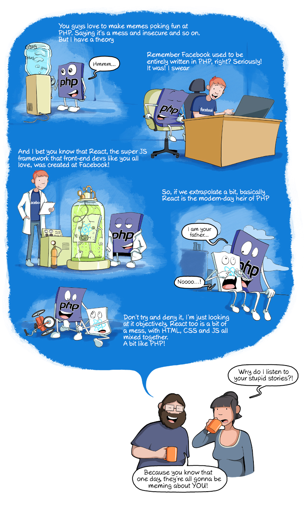

# PHP Fundamentals

Feel free to go to Laracasts, OpenClassroom, Grafikart, Codecademy, Sololearn... **As long as you meet the following learning objectives**.

1. [Learning objectives](./01-learning-objectives/)
2. [Variables](02-php-variables.md)
3. [Conditional structures](03-php-conditions.md)
4. [Arrays](04-php-arrays.md)
5. [Loops](05-php-loops.md)
6. [Functions](06-php-functions.md)
7. [Form](07-php-forms.md)
8. [GET & POST](08-get-post/)
9. [SESSION & COOKIE](09-session-cookie/)
10. [OUTDATED : Tuto for PDO, form, prepared request...](10-PDO-form/)

## Good resources for PHP

* [Laracasts - PHP for Beginners 2023 edition](https://laracasts.com/series/php-for-beginners-2023-edition)
* [PHP The Right Way](https://phptherightway.com/)
* [PHP Standards Recommandations](https://www.php-fig.org/psr/)
* [Program with Gio (Youtube)](https://www.youtube.com/playlist?list=PLr3d3QYzkw2xabQRUpcZ_IBk9W50M9pe-)
* [Grafikart](https://grafikart.fr/formations/php)

